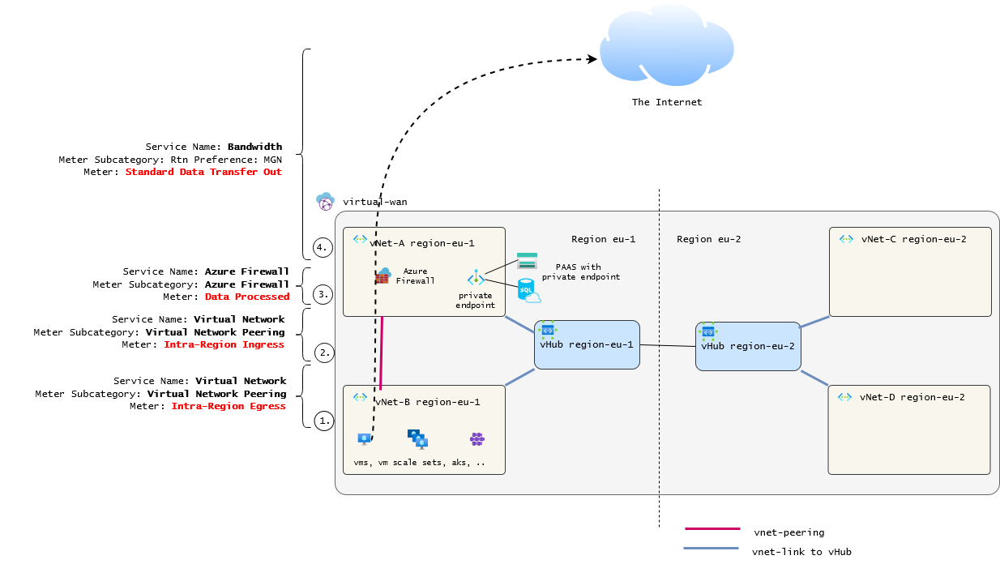
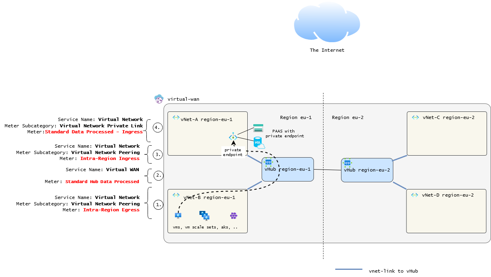
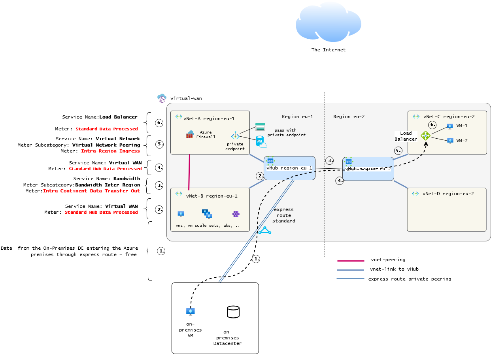

### Structure of this Article
- [Introduction](#introduction)
  - [Scope](#scope)
  - [Not in scope](#not-in-scope)

- [Concept: How does Azure meter network incurred costs](#concept-how-does-azure-meter-network-incurred-costs)
  - [Bandwidth](#bandwidth)
  - [Virtual Network](#virtual-network)
      - [Express Route](#express-route)
      - [Firewall](#firewall)
      - [Virtual WAN](#virtual-wan)

- [Billing Scenarios](#billing-scenarios)
  - [VM / AKS / VNET enabled service to Internet](#vm-internet)

- [Conclusion](#conclusion)

- [How to access cost management in Azure](#how-to-access-cost-management-in-azure)
  - GUI
  - Cost Management API
  - AZ CLI
  - Powershell

# Introduction 

Cost Management in Azure can be a straight forward topic. There maybe a resource with a fixed cost billed for the resource instance and some dynamic cost component which occurs based on the usage.

When it comes to network costs the situation gets confusing. Data transfer over the network is included in nearly all Azure operations. But not all  traffic is billed.

When you skim the documentation for this topic it is mostly pointed out that incoming traffic is free and Azure outgoing traffic costs 0.036 €/GB (at the time of creation) with 100GB free monthly.

Unfortunately it gets way more complex once you look into the details. This blog article shall make some of the details easier to understand. 

# Scope

This article covers regional and multi regional scenarios taking place in one Zone (Zone 1).

# Not in scope

When it comes to intercontinental traffic the cost structure is even more complex. This is not a part of this article though

# Concept: How does Azure meter network incurred costs

There are two types of network related costs. <a href="https://azure.microsoft.com/en-us/pricing/details/virtual-network/">vNet Peering</a> / <a href="https://azure.microsoft.com/en-us/pricing/details/bandwidth/?cdn=disable">Bandwidth charges</a> and Data processed charges.

Network transfer costs arise whereever your traffic traverses parts of the azure infrastructure. So one request can generate network-based costs in various places. 

In the subsequent chapters scenarios are described that shall help to identify when
which type of network related costs are triggered.

https://learn.microsoft.com/en-us/azure/virtual-wan/pricing-concepts

## Service Bandwidth

Bandwidth describes the traffic leaving the regional Azure premises or the traffic routed
to the Internet.

The service name "Bandwidth" consists of following meter subcategories

 * Outbound Data Transfer (Internet egress)
   - "Rtn Preference: MGN"  -> uses Microsoft global network - billed per GB
   - "Rtn Preference: ISP"  -> uses your ISPs breakout - billed per GB, slightly cheaper

 * Bandwidth Inter-Region , Data transfers between different Azure regions ( traffic that stays in the azure premises)

 The charges are then billed under one of the following meters 
  - Standard Data Transfer Out
  - Intra Continent Data Transfer Out
  - Inter Continent Data Transfer Out - NAM or EU To Any
  - Standard Data Transfer In (usually free)
  

## Service Virtual Network

Do not confuse the service "Virtual Network" with the resource Virtual Network. The costs for the service virtual network are assigned to each resource that generate them.

Virtual Networks are free so you will never find them in your cost analysis. All network related costs are assigned to the resources and services that generate them.

Meter Subcategory: **Virtual Network Peering**

In this subcategory you will find the traffic costs generated by VMs accessing Services though the vNet

* Intra-Region Ingress
* Intra-Region Egress

Meter Subcategory **Virtual Network-Private Link**

All costs generated by private endpoints will be gathered in this subcategory

* Standard Private Endpoint
* Standard Data Processed Egress
* Standard Data Processed Ingress

Note: A private endpoint allows a Platform-as-a-Service (PaaS) resource to be accessed from within a virtual network, instead of the public internet. 
<a href="https://learn.microsoft.com/en-us/azure/private-link/private-endpoint-overview">Further Reading on private endpoint</a>

## Service Express Route

Meter Subcategory

In this article we will use a sku standard, metered  Express Route which has costs of the following subcategories:

* Standard Metered Data  - Fixed costs for the Express Route provisioning / month
* Metered Data - Data Transfer Out - Billed / GB
* Data Transfer In - Usually Free

# Billing Scenarios

## VM to Internet over Azure Firewall

# 

(1)
A VM generates Traffic (In this example 1TB of traffic is sent) The traffic is routed via the virtual network peering
to the firewall in which the vNet resides.

(Important) In this scenario the traffic is routed via the existing vNet Peering. (Not via the vWWan Hub in this scenario)
(2) (3)
Then it enters the vNet of the Firewall (2) and the data is processed (3)

(4)
The Firewall then sends the traffic to the internet via the Microsoft Global Network Routing Preference in this case (4)

Cost breakdown for this scenario #1

|Waypoint | Amount billed| Cost descrtiption
------------|-----------|-------|
1.| 18,00 € | VNET Peering Egress
2.| 18,00 € | VNET Peering Ingress
3.| 14,40 € | Firewall Data Processed
4.| 68,81 € | Bandwidth Internet Egress 
-- | **119,21** | Total Cost for 1TB (1024 GB)

## VM to a private endpoint enabled PaaS

A VM accesses a private endpoint enabled storage account (can be any private endpoint enabled service like DB, cache).

# 

(1)
The traffic is routed through the vHub vNet Link Peering to the vHub.
(2)
The vHub processes (routes) the traffic.
(3) 
The traffic leaves the vHub to the Ressource via the vNet Link Peering.
(4) 
The request then reaches the network interface of the private Link enabled PaaS.

Cost Breakdown for Scenario #2

|Waypoint | Amount billed| Cost description
------------|-----------|-------|
1.| 9,06 € | vNet Link Peering Egress / Ingress
2.| 18,12 € | vHub Processing
3.| 9,06 € | vNet Link Peering Ingress / Egress
4.|  8,85 € | private Endpoint processing costs (outbound/inbound) 
-- | **63,21** | Total Cost for 1TB (1024 GB)

## On-Premises VM to an Azure VM that is in the backend pool of a load balancer in another region

# 

A VM on premises accesses a service through  an exppress route that  is behind a load balancer. 

(1) Traffic entering Azure through the express Route is not billed.

Note: It is likely though that the ISP provising the link for the Express Route will charge traffic fees.

(2)
The traffic is then routed through the regional vHub where it gets processed which incurs costs.

(3) The traffic is routed to the vWan Hub in the destination refion through the microsoft 
backbone which is billed accordingly.

(4)
The ingressing traffic is billed again in the destination vNet in which the lb and the vm reside.

(5) finally the standard loadbalancer will process the traffic accoring to the configured
loadbalancing rules which generates costs.

|Waypoint | Amount billed| Cost description
------------|-----------|-------|
1.| 0,00 € | ingress trafic enetering Azure free, might be subject to Internet provider billing
2.| 18,12 € | vHub Processing
3.| 18,03 € | Bandwidth Inter Region, Intra Continent Data Transfer Out
4.| 9,06 € | vNet Link Peering Ingress
5.|  4,53 € | LB, SKU Standard Data Processed
-- | **49,74** | Total Cost for 1TB (1024 GB)